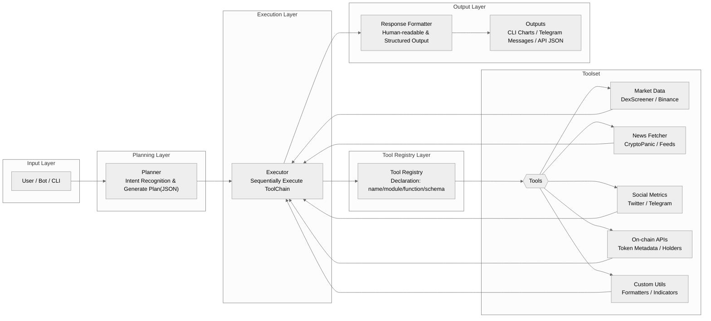

## Coreon-MCP-Execution-Engine
**Welcome to Coreon MCP Execution Engine**


## 1. Product Overview

**Coreon-MCP-Execution-Engine** provides a unified runtime for structured `ToolCall` chains. It allows LLM agents or users to:

> Dynamically execute multiple tools in sequence
>
> Interact via terminal, HTTP API, or Telegram
>
> Plug in custom tools via the modular `tools/` system
>
> Use anywhere via Docker — no manual setup required


This project is inspired by the idea of decoupling **agent planning** from **tool execution**, making it perfect for backend execution engines, plugin-based AI systems, or on-chain/off-chain hybrid AI workflows.

> Built-in modes: CLI / API Server / Telegram Bot
> Docker-native, zero local dependency
> Supports future extensibility with user-defined tools


## 2. Architecture Overview



#### Main module 

#####  **1. Planner (Task Parsing)**

>Acts as the “brain” of the MCP Engine. It takes natural language input from CLI, Telegram Bot, or API and:
>
>\- Recognizes user intent using LLM-based intent recognition.
>
>\- Generates a structured execution plan (`ToolCall Chain`) in JSON format.
>
>\- Breaks down complex tasks into ordered, executable steps.

##### **2. Executor (Chained ToolCall Execution)**

> The “execution core” responsible for carrying out the plan generated by the Planner:
>
> \- Executes tools step-by-step or in parallel when possible.
>
> \- Handles retries, error recovery, and logging.
>
> \- Ensures the correct order of execution across dependent tasks.

##### **3. Tool Registry (Centralized Tool Management)**

> A unified registry for all tools used by the MCP Engine:
>
> \- Declares each tool’s name, module path, function signature, and parameter schema.
>
> \- Stores tool metadata such as version and description.
>
> \- Allows new tools to be plugged in without changing the execution logic.

##### **4. Connectors (CLI, Telegram Bot)**

> Entry points for different user interaction modes:
>
> \- **CLI** – Developer-friendly command-line interface for direct execution and debugging.
>
> \- **Telegram Bot** – Chat-based interface for instant, on-the-go interactions.


## 3. Installation & Run

#### 1. Environment Requirements

> \- Python 3.11+
>
> \- Docker

#### 2. How to Install Docker

##### macOS / Windows / Linux

> 1. Download from the official Docker site:
>
>     https://www.docker.com/products/docker-desktop
>
> 2. Follow the installation steps.
>
> 3. After installation, run:
>
>    ```
>    docker --version
>    ```
>
>    If you see version output, Docker is installed.

#### 3. Environment Configuration (.env)

Follow these steps to get the MCP Engine running in minutes.

#####  1. Create the Execution Environment Directory

```
mkdir mcp-execution-env
cd mcp-execution-env
```

##### 2. Create the .environment File

Generate the environment file with required variables:

```
cat <<EOF > .env
MCP_LANG=EN
OPENAI_API_KEY=sk-xxxxxxxxxx
EOF
```

| Variable         | Description            | Required |
| ---------------- | ---------------------- | -------- |
| `MCP_LANG`       | Language: `EN` or `ZH` | Yes      |
| `OPENAI_API_KEY` | OpenAI API Key         | Yes      |

> Replace sk-xxxxxxxxxx with your actual **OpenAI API key**.


## 4. Quick Start

#### 1. Pull the Docker Image

````
docker pull coreonmcp/coreon-mcp-execution-engine
````

#### 2. Start CLI Mode

````
docker run --rm -it --env-file .env coreonmcp/coreon-mcp-execution-engine start cli
````

#### 3. API Server Mode

````
docker run --rm -it --env-file .env -p 8080:8080 coreonmcp/coreon-mcp-execution-engine start server
````

#### 4. Telegram Bot Mode

````
docker run --rm -it --env-file .env coreonmcp/coreon-mcp-execution-engine start telegram-bot
````

## 🔗 BNB Chain Integration

Coreon MCP Execution Engine is designed as the AI Execution Layer for Web3, with a strong focus on the BNB Chain ecosystem (BSC / BNB Smart Chain).
> Current support: Query balances, token metadata, DeFi data, and contract calls on BNB Smart Chain (BSC).
>
> Mid-term roadmap: Natural-language swaps on PancakeSwap, AI wallet assistants, and on-chain security monitoring for BNB users.
> 
> Future vision: Expand to opBNB (for low-cost L2 execution) and Greenfield (for decentralized data storage), making Coreon MCP a full-stack AI interface for the entire BNB ecosystem.

By bridging natural language with on-chain execution, Coreon MCP lowers entry barriers and positions BNB as the first AI-Ready blockchain.

## 🌟 Future Vision

Our story is just beginning.
The MCP Execution Engine will keep evolving — becoming smarter and more powerful with every iteration.
We’ll continue to refine features, explore new possibilities, and work hand in hand with developers to shape the future of Web3.


