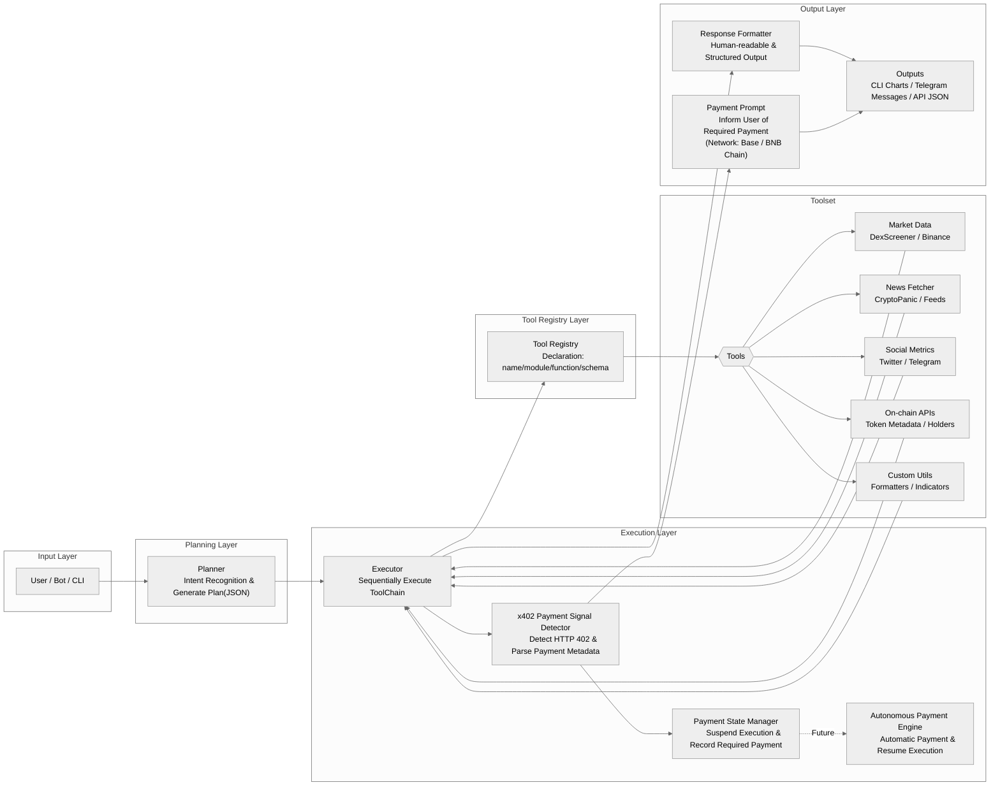

## Coreon-MCP-Execution-Engine
**Welcome to Coreon MCP Execution Engine**

**A modular execution engine for MCP agents —  now enhanced with native x402 payment signal support.**

## Overview
MCP (Model Context Protocol) is evolving into the execution engine for the emerging Agent Economy.
To support pay-per-use services and on-chain paid APIs, we are adding native support for the x402 payment signal protocol (HTTP 402 Payment Required).

With this update, MCP becomes the first x402-ready Agent Execution Engine on BNB Chain.

## 1. Phase 1 — x402 Signal Support (Shipping Soon)

**MCP can now recognize and manage external resources that require payment:** 

1. Automatically detect HTTP 402 (x402) responses
2. Parse payment metadata:
    a. network (Base / BNB Chain supported)
    b. asset (e.g. USDC / USDT)
    c. amount & timeout
    d. payment receiver
3. Suspend execution and prompt users about the required payment
4. Maintain ToolCall context for later continuation

**This phase focuses on signal detection, interruption awareness, and state management.**

> Today, MCP knows when a resource requires payment
> — and tells the user clearly what is needed

## 2. Phase 2 — Autonomous Agent Payments (In Development)

**We are building autonomous payment execution so Agents can:** 
1.	Identify which network & asset to use
(e.g. USDC on Base / USDT on BNB Chain)
2.	Submit payment automatically or via user confirmation
3.	Verify receipt and resume suspended execution
4.	Complete full pay-per-use workflows without human intervention

> Very soon, Agents will pay by themselves and keep working.

## 3. Architecture Overview

## 4. Why This Matters 
**Before vs With x402 Support**

| Before | With x402 Support |
|--------|------------------|
| Tools fail on paid APIs | MCP pauses and informs the user |
| Users don’t know why a tool stops | Transparent payment requirement |
| Manual restarts needed | Automated recovery *(very soon)* |
| No revenue model for tools | Built-in commercial execution |

**This unlocks**
1. pay-per-call API monetization
2. decentralized machine-to-machine commerce
3. scalable autonomous agents
4. **MCP as execution OS for x402 services**

## 5. Example User Flow
1. User triggers a paid tool
2. MCP detects x402 → Payment Required
3. MCP suspends execution
4. User/Agent pays
5. MCP validates & continues execution

## 6. Vision
**MCP + x402**
-> Agents not only think and act
-> They can trade, pay, and economically operate 🚀

**We are building the execution layer of the x402 economy.**
